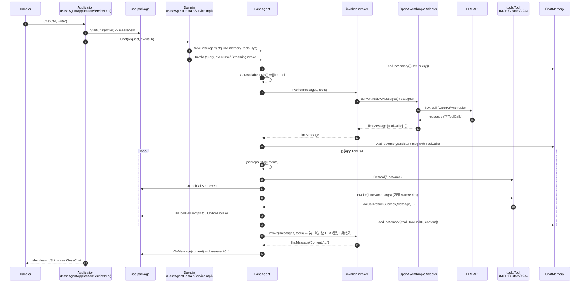

# 工具调用全链路

> 一次"用户提问 → LLM 决定调用工具 → 工具执行 → 结果回写 LLM"在 mooc-manus 内的端到端调用链。约束见 `R-44-tool` / `R-42-llm` / `R-45-event`；本文聚焦"代码上每一跳走在哪里"。

## 总览（Mermaid）



> 上图覆盖典型 1-2 轮路径。`MaxIterations` 之内可多轮往返，超限发 `error` 事件。流式版本（`StreamingInvoke`）多一层 `llmEventCh`，把 LLM 流式 token 实时转发到 `eventCh`。

## 关键入口与文件

| 跳数 | 调用方 | 被调用 | 文件 |
|-----|--------|--------|------|
| 1 | Handler | `BaseAgentApplicationServiceImpl.Chat` | `internal/applications/services/agent.go` |
| 2 | App | `sse.StartChat` 取 `messageId` | `internal/infra/external/sse/` |
| 3 | App | `agentDomainSvc.Chat(req, eventCh)` | `internal/domains/services/agents/agent.go` |
| 4 | Domain | `createBaseAgent` → `NewBaseAgent` | `agent.go` + `base.go` |
| 5 | Agent | `Invoke` / `StreamingInvoke` | `base.go` |
| 6 | Agent | `InvokeLLM` → `invoker.Invoke(messages, tools)` | `base.go` + `invoker/invoker.go` |
| 7 | Adapter | SDK 调用（OpenAI / Anthropic） | `internal/infra/external/llm/{openai,anthropic}_adapter.go` |
| 8 | Agent | `InvokeToolCalls` 逐个执行 | `base.go` |
| 9 | Tool | `tool.Invoke(funcName, args)` | `internal/domains/services/tools/{mcp,custom,a2a,builtin}.go` |
| 10 | App | drain `eventCh` → `sse.SendEvent` | `agent.go`（application 层） |

## 三类工具的内部分支

`Agent.GetTool(funcName)` 用线性扫描在 `tools []tools.Tool` 找首个 `HasTool(funcName) == true` 的实例。`tools.InitTools` 在 DI 阶段按 `providerType` 字段决定类型（`tools/base.go::InitTools`）：

- **MCP**（`NewMcpTool`）：远端 stdio / SSE 协议，复用 mcp-go client；适合标准化第三方工具。
- **CUSTOM**（`NewCustomTool`）：HTTP / 自定义协议封装；用户自有工具的常见落点。
- **A2A**（`NewA2ATool`）：本地起 a2a-go server 包装的工具，把"远端 Agent 的能力"伪装成本地 tool 供 LLM 调用。

三类工具共享统一签名（`Tool` 接口）：`GetTools() []llm.Tool` / `HasTool` / `Invoke` / `Init` / `ProviderName`。R-44 §"三类工具边界" 给出完整列表。

## Error / Retry 切面

- **参数解析失败**：`InvokeToolCalls` 中先走 `jsonrepair.JSONRepair(funcArgs)`；修复失败 → 写一条 `{Role:Tool, Content:"参数解析失败..."}` 进 memory，发 `OnToolCallFail`，**不中断循环**，继续处理下一个 ToolCall。
- **工具不存在**：`GetTool(name) == nil` → 同上策略，进 memory + `OnToolCallFail`。
- **工具调用失败**：`InvokeTool` 内部按 `agentConfig.MaxRetries` 重试；最终失败仍返回 `ToolCallResult{Success:false}`，并在 memory 写 `"工具调用失败：" + result.Message`，便于 LLM 在下轮选择重试或换工具。
- **LLM 调用失败**：`InvokeLLM` 内部走 `MaxRetries` + `time.Sleep(retryInterval)`，失败累积到 `errs []error`，最终 `errors.Join` 上抛 → Agent 内转为 `OnError` 事件。

## 事件发布约束

R-45 §"事件类型清单" 规定一次完整 tool 流必须含：

```
tool_call_start → tool_call_complete | tool_call_fail
```

`tool_call_start` 与 `tool_call_complete/fail` 共享同一 `ToolCallID`（由 LLM 返回，进 `llm.ToolCall.ID` → `events.ToolEvent.ToolCallID`）。Application 层不应该再发明新事件类型，新增必走 R-45 + 总仓 `event-protocol.md`。

## 与 LLM 协议抽象的耦合点

工具到 `llm.Tool` 的转换发生在 `BaseTool.GetTools()` → `convertDO2Tool(function)`（`tools/convert.go`），输出厂商无关的 `llm.Tool{Name, Description, Parameters}`。Adapter 在 SDK 边界把它转成 OpenAI / Anthropic 各自的 tool schema，详见 ADR-0001 §"决策"。这是 R-42 与 R-44 的接缝。

## 调用方需要做的最少事

- Handler：只负责 JSON 解析 + 调 application；不接触 domain / tools。
- Application：注入 `messageId`、startChat / closeChat、drain `eventCh`、cleanup skill 容器（详见 R-48）。
- Domain：组装 Agent + 调 `Invoke`，**不直接 write SSE**（R-45）。
