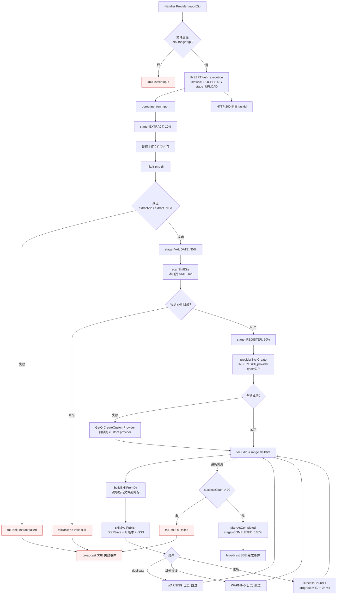
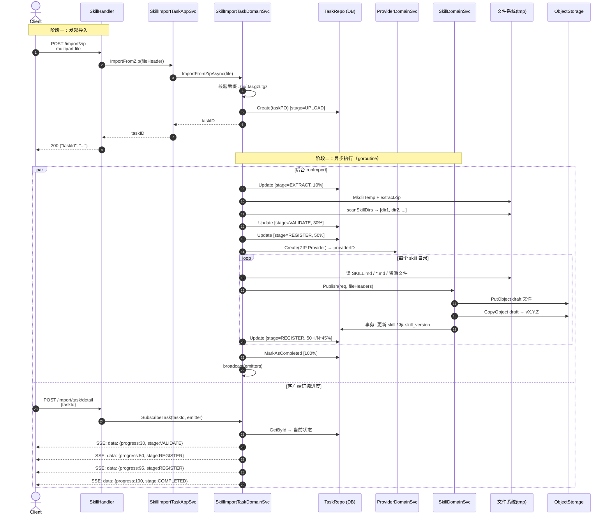

# Skill Import 三接口对比与 runImport 流程解析

> 范围：`api/handlers/skill.go` 中 Provider 子域的三个 import 接口
>
> - `POST /api/v1/skill/provider/import/zip`        → `SkillHandler.ProviderImportZip`
> - `POST /api/v1/skill/provider/import/zip/legacy` → `SkillHandler.ProviderImportZipLegacy`
> - `POST /api/v1/skill/provider/import/git`        → `SkillHandler.ProviderImportGit`

---

## 1. 三个接口到底干了什么

读源码时最容易被误导的地方是「名字相似 = 行为相似」。实际上三者职责完全不同：

| 接口 | 入口 Handler | 应用层 Service 方法 | 是否解压 | 是否注册 Skill | 是否异步 | 返回值 |
|---|---|---|---|---|---|---|
| `/import/zip` | `ProviderImportZip` | `skillImportTaskAppSvc.ImportFromZip` | 是 | 是（调用 `SkillDomainService.Publish`） | 是（goroutine + SSE） | `{ "taskId": "..." }` |
| `/import/zip/legacy` | `ProviderImportZipLegacy` | `skillProviderAppSvc.ImportZipLegacy` | 否 | 否 | 否 | `SkillProviderInfo` |
| `/import/git` | `ProviderImportGit` | `skillProviderAppSvc.ImportGit` | 否 | 否 | 否 | `SkillProviderInfo` |

### 1.1 `/import/zip`（新版，端到端导入）

走的是 `SkillImportTaskApplicationService` → `SkillImportTaskDomainService.ImportFromZipAsync`。
HTTP 请求只做一件事：**校验后缀（`.zip` / `.tar.gz` / `.tgz`）→ 在 `task_execution` 表插一条任务 → 起 goroutine 跑 `runImport` → 立刻返回 `taskId`**。

真正的业务逻辑在 `runImport` 里完成（解压、扫描 `SKILL.md`、创建 ZIP 类型 Provider、对每个 skill 目录调用 `SkillDomainService.Publish`），客户端通过 `POST /api/v1/skill/provider/import/task/detail` 的 SSE 长连接订阅进度。

### 1.2 `/import/zip/legacy`（旧版，仅登记元数据）

`SkillProviderApplicationServiceImpl.ImportZipLegacy` 只做了一件事：

```go
do := dtos.ConvertImportZipLegacyRequest2DO(req)
id, err := s.providerDomainSvc.Create(do)  // 仅 INSERT skill_provider
```

它不接收文件、不解压、不创建 Skill 记录。本质上是「我手上有一个 ZIP，先把 Provider 元数据登记一下，里面的 Skill 以后再想办法填」。**保留它是为了向后兼容老调用方**，新流程应该一律走 `/import/zip`。

### 1.3 `/import/git`（仅登记 Git 仓库 Provider）

`ImportGit` 与 `ImportZipLegacy` 是同一种模式——只 INSERT 一条 `skill_provider` 记录（`provider_type=GIT`，带 `repo_url`）。**真正的仓库克隆和 Skill 注册没有实现**：

```go
// internal/domains/services/skill_provider.go:122
// Sync 当前实现仅校验存在性与状态；真实仓库扫描由 GIT importer 实现
func (s *SkillProviderDomainServiceImpl) Sync(id string) (...) {
    // 只校验 provider 存在 + status=ACTIVE，没有任何 git clone / scan 逻辑
}
```

也就是说，`/import/git` 是占位实现，等后续补一个 GIT importer 来异步拉仓库（参考 `/import/zip` 的异步任务模式）。

---

## 2. 为什么主流程不一样

> 「针对 provider 的 import 接口，DB 操作主流程不应该是一样的吗？」

不是。原因有两个层面：

**职责切分不同**。`SkillProvider` 是「Skill 的来源元数据载体」（仓库 URL、ZIP 文件名、认证类型……），它本身可以独立存在，里面到底有几个 Skill 是另一个问题。**`/import/git` 和 `/import/zip/legacy` 处理的是 Provider 这个聚合根本身的注册**；而 `/import/zip` 处理的是「Provider + 它包含的所有 Skill」的端到端导入。

**实现演进阶段不同**。代码里能明显看到三种状态：

- ZIP 流程：已经做完了端到端方案 → 走异步任务 + SSE。
- GIT 流程：仅完成 Provider 登记，仓库扫描的部分是 TODO（见 `Sync` 注释）。
- ZIP Legacy：是 ZIP 端到端方案上线前的产物，留作兼容。

所以从架构上理解，三者都是「import」，但前两者只覆盖了 `skill_provider` 一张表的写入，只有 `/import/zip` 把 `skill` / `skill_version` / `task_execution` 一起串起来。

> 一句话总结：**`/import/zip` 是完整方案；另外两个是「先登记元数据，Skill 待补」的轻量入口**。

---

## 3. `runImport` 详细流程

### 3.1 五阶段进度模型

任务对象 `TaskExecutionDO` 用 `Stage` + `Progress(0–100)` 描述进度：

| Stage | Progress | 触发位置（`skill_import_task.go`） | 含义 |
|---|---|---|---|
| `UPLOAD` | 0 | `ImportFromZipAsync` 创建任务时（行 85） | 任务已建，文件已收 |
| `EXTRACT` | 10 | `runImport` 入口（行 104） | 准备解压 |
| `VALIDATE` | 30 | 解压完成后（行 137） | 扫描 `SKILL.md` 通过 |
| `REGISTER` | 50 → 95 | 每注册完一个 skill 递增（行 190） | 逐个 Publish skill |
| `COMPLETED` | 100 | `MarkAsCompleted`（行 200） | 全部完成 |

任何阶段出错都会走 `failTask`，状态置为 `FAILED` 并记录 ERROR 日志。

### 3.2 流程图（控制流）



### 3.3 时序图（含 SSE 订阅）



---

## 4. 一个具体示例：上传 `my-skills.zip`

### 4.1 输入

`my-skills.zip` 解压后的结构：

```
my-skills/
├── greet/
│   ├── SKILL.md           # 内容：# Greet Skill
│   └── prompt.txt
└── translate/
    ├── SKILL.md           # 内容：# Translate Skill
    └── prompt.txt
```

请求：

```
POST /api/v1/skill/provider/import/zip
Content-Type: multipart/form-data
file=@my-skills.zip
```

返回：

```json
{ "taskId": "9f3b1c20-..." }
```

### 4.2 文件操作时间线

| 时刻 | 操作 | 路径/对象 |
|---|---|---|
| T0 | `os.MkdirTemp` 建临时目录 | `/tmp/skill_import_xxx/` |
| T1 | `extractZip` 解压全部文件 | `/tmp/skill_import_xxx/my-skills/greet/...`，`/tmp/skill_import_xxx/my-skills/translate/...` |
| T2 | `scanSkillDirs` 找到含 `SKILL.md` 的目录 | `[/tmp/.../greet, /tmp/.../translate]` |
| T3 | （greet）`uploadFiles` 写 OSS draft 版 | `beedance-skill/{greetSkillId}/draft/SKILL.md`，`beedance-skill/{greetSkillId}/draft/prompt.txt` |
| T4 | （greet）`Publish` 内 `CopyObject` 提升为正式版 | `beedance-skill/{greetSkillId}/0.0.1/SKILL.md`，`beedance-skill/{greetSkillId}/0.0.1/prompt.txt` |
| T5 | （greet）异步打 ZIP 包 | `beedance-skill/{greetSkillId}/0.0.1/{greetSkillId}-0.0.1.zip` |
| T6–T8 | （translate）重复 T3–T5 | 路径前缀替换为 `{translateSkillId}` |
| T9 | `defer os.RemoveAll(tmpDir)` | `/tmp/skill_import_xxx/` 清理 |

OSS 路径模板来自 `dtos.SkillFilePathTemplate = "%s/%s/%s"`，bucket 是 `beedance-skill`。

### 4.3 数据库变更时间线

> 表名沿用代码注释中的逻辑名（实际表名以 PO 定义为准）

| 时刻 | 表 | 操作 | 关键字段 |
|---|---|---|---|
| T0 | `task_execution` | INSERT | `task_id=9f3b1c20`, `app_id=SKILL_APP`, `app_type=SKILL_IMPORT`, `status=PROCESSING`, `stage=UPLOAD`, `ext_info.file_name=my-skills.zip` |
| T1 | `task_execution` | UPDATE | `stage=EXTRACT`, `progress=10` |
| T2 | `task_execution` | UPDATE | `stage=VALIDATE`, `progress=30` |
| T3 | `task_execution` | UPDATE | `stage=REGISTER`, `progress=50` |
| T3 | `skill_provider` | INSERT | `provider_name=ZIP_IMPORT_9f3b1c20_my-skills`, `provider_type=ZIP`, `status=ACTIVE` |
| T4 (greet) | `skill` | INSERT | `skill_id={greetId}`, `skill_name=greet`, `provider_id=ZIP_IMPORT_...` |
| T4 (greet) | `skill_version` | INSERT | `skill_id={greetId}`, `version=draft`，`skill_files=[…]`（指向 `/draft/` OSS key） |
| T4 (greet) | `skill_version` | INSERT | `skill_id={greetId}`, `version=0.0.1`，`skill_files=[…]`（指向 `/0.0.1/` OSS key） |
| T4 (greet) | `skill` | UPDATE | `latest_version_id=<新版本 PO 的 ID>` |
| T4 (greet) | `task_execution` | UPDATE | `progress=72` (= 50 + 1/2*45) |
| T7 (translate) | `skill` / `skill_version` | INSERT × 3 + UPDATE × 1 | 同上，前缀换为 `{translateId}` |
| T7 (translate) | `task_execution` | UPDATE | `progress=95` (= 50 + 2/2*45) |
| T8 | `task_execution` | UPDATE | `status=COMPLETED`, `stage=COMPLETED`, `progress=100`, `ext_info.skill_count=2`, `ext_info.provider_id=...` |

### 4.4 边界情况一览

| 情况 | 行为 |
|---|---|
| 上传文件后缀不在白名单 | 同步返回 400 `InvalidInput`，不建任务 |
| 解压失败（zip 损坏） | 任务 `FAILED`，stage 停留在 EXTRACT |
| 压缩包里没有 `SKILL.md` | 任务 `FAILED`：`no valid skill found in archive` |
| ZIP Provider 名重复 | 降级调用 `GetOrCreateCustomProvider`，把 skill 挂到全局 `custom` provider |
| 单个 skill 同名（duplicate） | WARNING 日志 + 跳过，**不影响其他 skill 注册** |
| 全部 skill 都失败 | 任务 `FAILED`：`all skills failed to register` |
| 有 1 个成功 + N-1 失败 | 任务 `COMPLETED`，`ext_info.skill_count` 只计成功数 |
| 异步打包 ZIP 失败 | 仅记 WARN 日志，不影响 Publish 结果 |

---

## 5. 阅读源码时的几个对照点

- 任务对象的状态机定义在 `internal/domains/models/task_execution.go`：`MarkAsCompleted` / `MarkAsFailed` / `UpdateProgressInfo` / `AppendLog`。
- 进度推送通过 `SkillImportTaskDomainServiceImpl.emitters`（`map[taskID][]SseEmitter`）维护，每次 `broadcast` 时遍历推送；任务结束（`!= PROCESSING`）即清理订阅者。
- `skill_import_task.go` 末尾的 `wrappedFileHeader` 是历史遗留代码（注释标注「技术债」），当前 `buildFileHeaders` 走的是临时文件路径，注意未来重构。
- 真正的 OSS 写入逻辑集中在 `SkillDomainServiceImpl.uploadFiles` 与 `Publish` 中的 `CopyObject`，`runImport` 自己不直接写 OSS。
